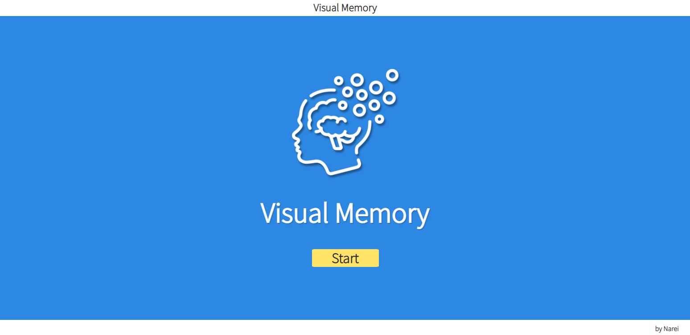
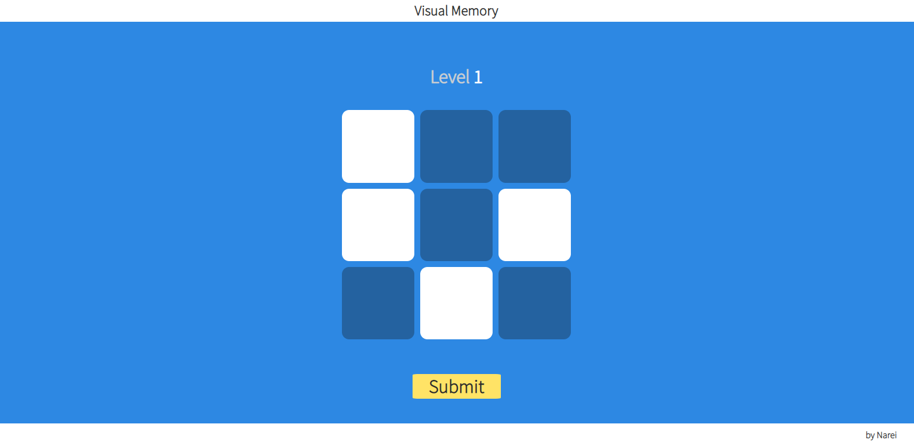

# VisualMemory
Simple VisualMemory game made in Vue.js

* [Technologies](#technologies)
* [Setup](#setup)
* [TODO](#todo)
* [Photos](#photos)

## Technologies:
Project is created with:
* Vue.js 3
* Vue-router 4

## Photos

